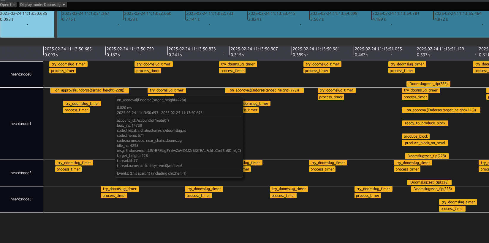

# Traviz

Trace visualizer for NEAR



## How to use

1. Start tracing collector

```console
git clone https://github.com/near/nearcore
cd tracing
docker compose up
```

2. Modify `log_config.json` to output traces from nodes, for example:
```json
{
  "rust_log": "debug",
  "verbose_module": null,
  "opentelemetry": "debug"
}
```

3. Modify `config.json` to send traces to the collector, for example:
```json
"telemetry": {
    "endpoints": ["http://127.0.0.1:4317"],
    "reporting_interval": {
      "secs": 10,
      "nanos": 0
    }
  }
```

4. Run the nodes, collector should be outputting:
```console
Persisting trace of size .. bytes
Persisting trace of size .. bytes
Persisting trace of size .. bytes
```

5. Download the trace from the collector
```console
curl -X POST http://127.0.0.1:8080/raw_trace -H 'Content-Type: application/json' -d "{\"start_timestamp_unix_ms\": $START_TIME, \"end_timestamp_unix_ms\": $END_TIME, \"filter\": {\"nodes\": [],\"threads\": []}}" -o trace.json
```

6. Start `traviz` and open the trace file. Choose the right display mode and explore. Watch out - sometimes the file picker opens behind the main window!
```
cargo run --release
```

## Controls

See [CONTROLS.md](doc/CONTROLS.md)

## Display modes

There are different display modes, each is meant to show the system from a different angle.
The current display mode can be chosen using the dropdown menu on the top bar.

They are implemented in `src/modes.rs`. Each mode is a function which reads the raw trace data and
outputs spans that will be displayed to the user. Each mode can filter, modify, or generate new
spans based on the raw trace data, as needed to visualize things.